## PART1 

# 1. Запустил 3 виртуальные машины с помощью vagrant 
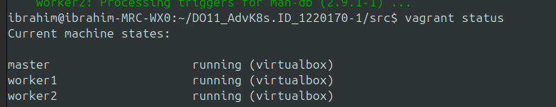 

# 2. Установил k3s на всех трех машинах. При установке не использовал стандартный Ingress Controller при помощи флага --disable=traefik. 
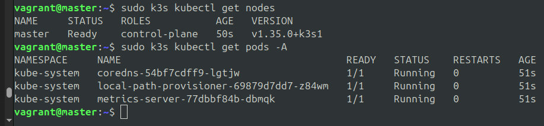

# 3. Выполнил подключение узлов к кластеру, используя команду k3s server и флаги --token и --server для рабочих узлов и мастера соответственно 
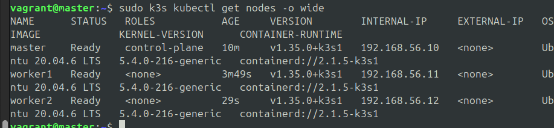

# 4.1 Проверка отсутсвия traefik 
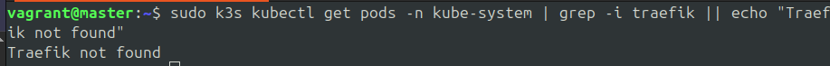
# 4.2 Установил Ingress 
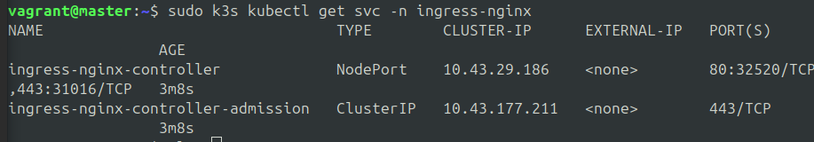

# 5. Не было возможности получить собственный домен поэтому сделал с помощью selfmade сертификата 
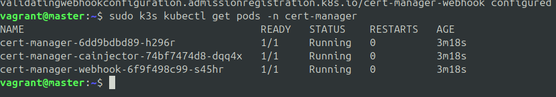
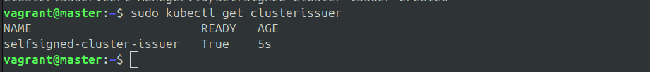
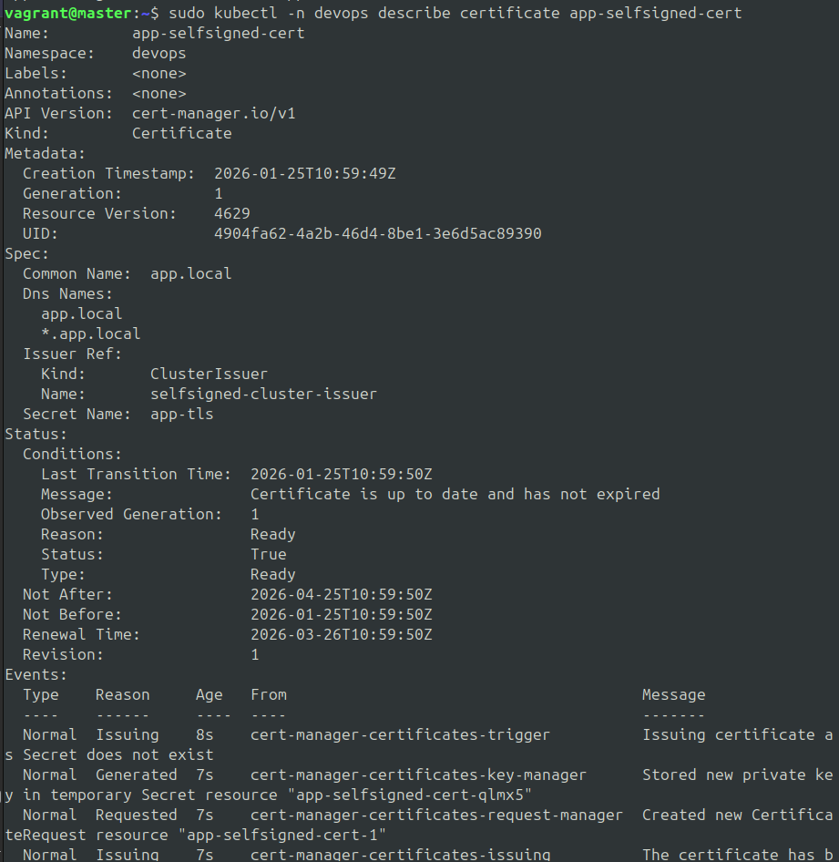

# 6. создал ресур ingress для использования контроллера 
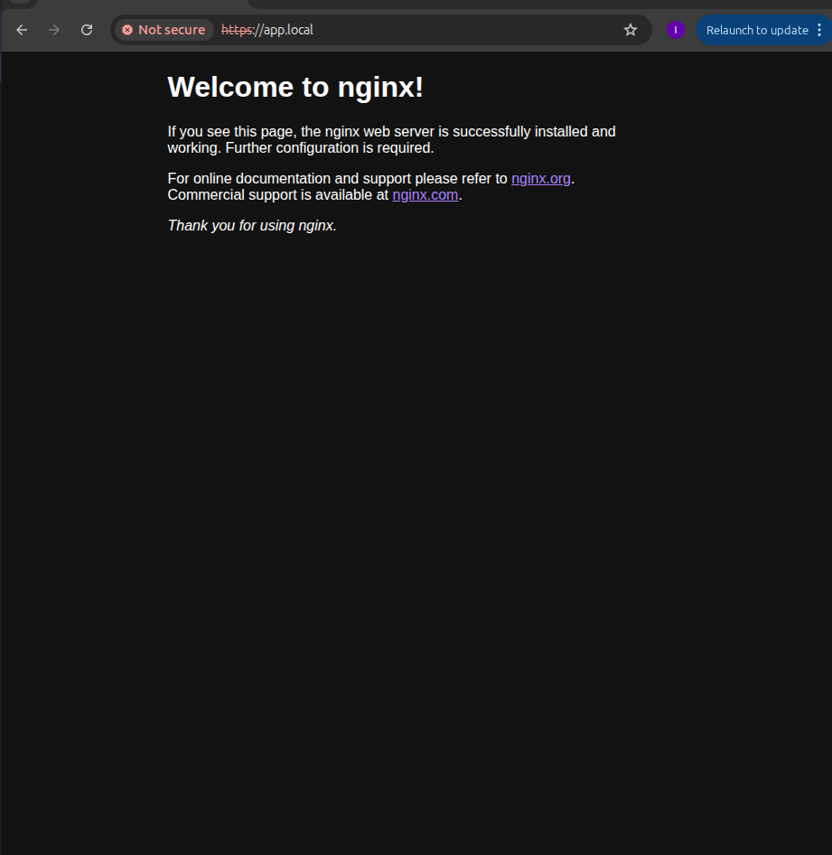

# Создал PV для базы данных Postrgre 
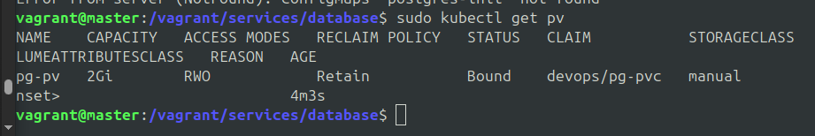
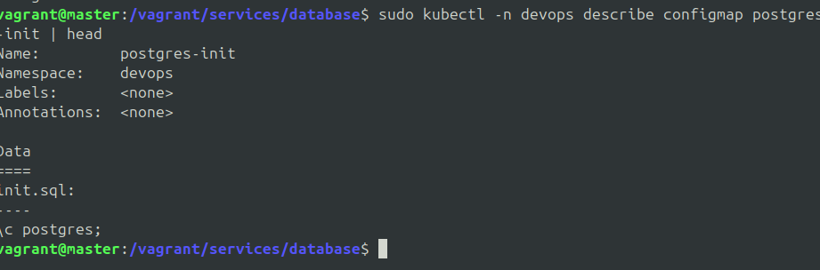
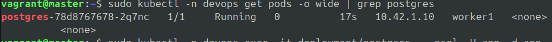

# 8 Запустил приложение 
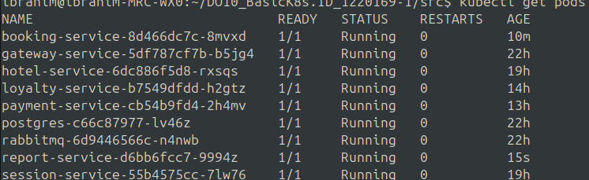

# 9 Запустил тесты Postman 

# 10 Установил и запустил Prometheus Operator и выполнил команду kubectl get pods -n monitoring 
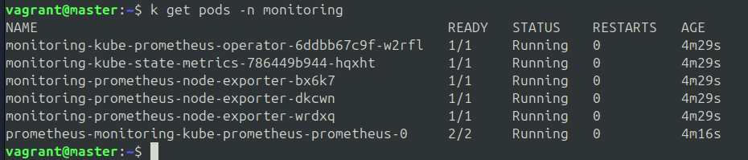
